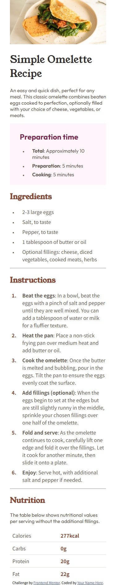

# Frontend Mentor - Recipe page solution

This is a solution to the [Recipe page challenge on Frontend Mentor](https://www.frontendmentor.io/challenges/recipe-page-KiTsR8QQKm). Frontend Mentor challenges help you improve your coding skills by building realistic projects. 

## Table of contents

- [Overview](#overview)
  - [The challenge](#the-challenge)
  - [Screenshot](#screenshot)
  - [Links](#links)
- [My process](#my-process)
  - [Built with](#built-with)
  - [What I learned](#what-i-learned)
  - [Continued development](#continued-development)
  - [Useful resources](#useful-resources)
- [Author](#author)
- [Acknowledgments](#acknowledgments)

## Overview

### Screenshot




### Links

- Solution URL: [Add solution URL here](https://your-solution-url.com)
- Live Site URL: [Add live site URL here](https://your-live-site-url.com)

## My process

### Built with

- Semantic HTML5 markup
- CSS custom properties
- no Flexbox
- no CSS Grid
- Mobile-first workflow

### What I learned

style-guide 활용하는 방법 (css variable)

```css
:root {
      --White: hsl(0, 0%, 100%);

      --Stone-100: hsl(30, 54%, 90%);
      --Stone-150: hsl(30, 18%, 87%);
      --Stone-600: hsl(30, 10%, 34%);
      --Stone-900: hsl(24, 5%, 18%);

      --Brown-800: hsl(14, 45%, 36%);

      --Rose-800: hsl(332, 51%, 32%);
      --Rose-50: hsl(330, 100%, 98%);
    }
```

미디어 쿼리 (@media)
```css
    @media (min-width: 768px) {
      body {
        ...
      }

      .main {
        ...
      }

      .main img{
        ...
      }
    }
```

## Author

- Website - [me](https://www.your-site.com)
- Frontend Mentor - [@Aeroxol](https://www.frontendmentor.io/profile/Aeroxol)

**Note: Delete this note and add/remove/edit lines above based on what links you'd like to share.**

## Acknowledgments

This is where you can give a hat tip to anyone who helped you out on this project. Perhaps you worked in a team or got some inspiration from someone else's solution. This is the perfect place to give them some credit.

**Note: Delete this note and edit this section's content as necessary. If you completed this challenge by yourself, feel free to delete this section entirely.**
